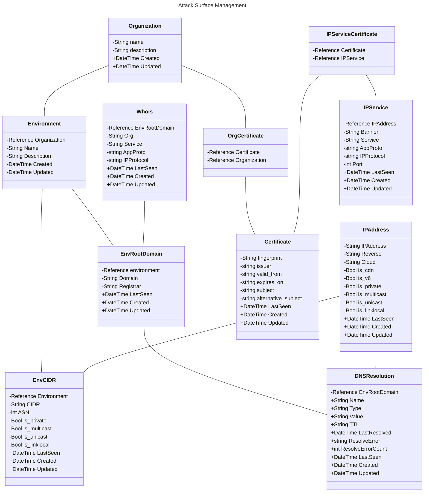

> Attack Surface Management  
> [Docs](https://analog-substance.github.io/sulfur/) :: [Releases](https://github.com/analog-substance/sulfur/releases) :: [Code](https://github.com/analog-substance/sulfur/)  
> [](https://github.com/analog-substance/sulfur/actions/workflows/go-tests.yml)

## Purpose

Maintain long term information about a target environment
* * *

## Features


## Installation

Download a [release from GitHub](https://github.com/analog-substance/sulfur/releases) or use Go Install:

```sh
go install github.com/analog-substance/sulfur@latest
```
* * *

## Feedback

### I have an issue or feature request

Sweet! [Open an issue](https://github.com/analog-substance/sulfur/issues/new) to start the conversation.

* * *

## Database layout (planned)





